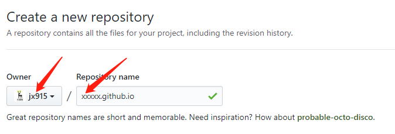
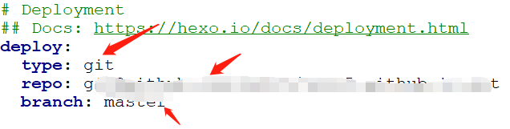
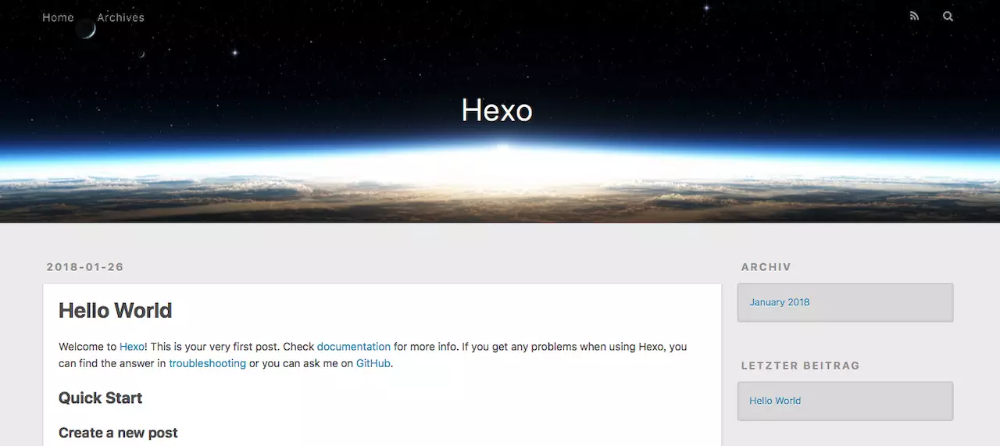

> 这两天通过一些文章以及官方文档终于搭建起了属于自己的博客站点，后续会不断的分享折腾hexo主题的经验。

<!-- more -->

## 准备工作

- [安装node.js](http://nodejs.cn/download/)
- [安装Git](https://git-scm.com/)
- [github账号](https://github.com/)


## 撸起袖子开干

### 一：创建github仓库

**特别强调：** 两个红箭头指向的名称要一致，比如我就是jx915，后面xxxx也要填jx915



### 二：部署ssh

参考文章：[github配置ssh](https://blog.csdn.net/jx950915/article/details/80444969)

### 三：创建本地文件夹（用来存放hexo源文件）

**1、全局安装`hexo`,桌面鼠标右键 `git base here`**

 ```
 npm install hexo --global
 ```

  **2、初始化`hexo`,在新建文件夹右键 `git base here`**

 ```
hexo init
npm install
 ```
 
 执行成功后文件目录结构
 ```
├── _config.yml
├── package.json
├── scaffolds
├── source
|   └── _posts
└── themes
 ```
- `_config.yml`:站点配置文件

- `scaffolds`:模板文件 ，规定了我们创建一篇文章的时候最开始的样子

- `source`: 存放md文件

- `themes` : 存放主题文件

**3、部署到git**

**配置**：修改我们的的站点配置文件`_config.yml`中如下字段



- `type`: git

- `repo` : 仓库地址(ssh地址)

- `branch` : master

**终端执行命令**
```
hexo clean

hexo g

hexo s 

hexo d
```
- `hexo clean` : 清除缓存

- `hexo g` :进行渲染

- `hexo s` :本地调试 浏览器输入`http://localhost:4000`可以看到效果

- `hexo d` :部署到git 执行成功后浏览器输入`http://你github名字.github.io` 可以看到效果

所以这里是有四步，不过熟练之后可以直接`hexo d`也就是不进行本地预览

**预览效果**



**4、新建文章**

```
 hexo new post “文章名字” 
```
建立好的文章在 `source/_posts` 中，你可以用`markdown`语法编辑内容就可以。编辑完成后执行第3步中终端的操作就可以啦，刷新下浏览器就可看到你的新文章啦。如下图


