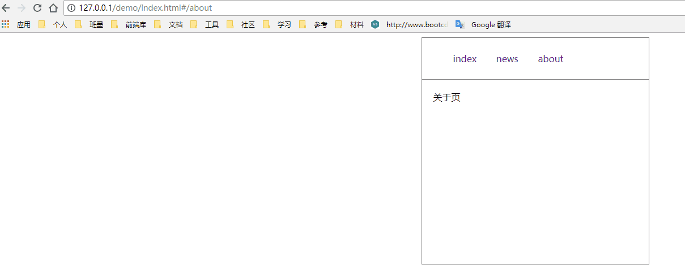

> window.location 处理哈希的改变时不会重新渲染页面，而是当作新页面加到历史记录中，这样我们跳转页面就可以在 hashchange 事件中注册 ajax 从而改变页面内容。

<!-- more -->

#### 分析

`angular 1.x`的路由是直接引入`html`文件的，所以从这一点逐步分析。

1、我们在`angular 1.x`的路由中会看到 `#`,这个 `#` 有两种意思，一种是锚点，也就是单页面跳转到具体的块`div`;第二种也就是我们要说的，路由中的`#`，路由里的 # 不叫锚点，我们称之为 hash，大型框架的路由系统大多都是哈希实现的。

2、根据监听哈希变化触发的事件 —— `hashchange` 事件

3、加载页面采用`jquery.ajax()`的 `load()` 方法

#### 开工

##### 一：简单介绍`load()`方法

`index.html`

```
<div id="router">

</div>
<script src="https://cdn.bootcss.com/jquery/3.3.1/jquery.min.js"></script>  
//下面两种方法都可以引入一个html文件的内容到id=router中
$.ajax({
    url:'./test.html',
    type:'get',
    success:function(res){
        $('#router').html($(res));
    }
});
// $('#router').load('./test.html');
```
同级目录下`test.html`
```
<section>
    <div>ss</div>
    <div id="warp">11</div>
    <div class="warp">22</div>
</section>

<script>
    $('#router').css('color','red');
</script>
```


了解更多：[ajax加载html文件](https://blog.csdn.net/jx950915/article/details/80591638)


##### 二：写入`router`方法

`router.js`

```
function Router(){
    this.routes={};
    this.currentURL='';
}

//配置 定义方法
Router.prototype.route = function(path,callback){
    this.routes[path] = callback || function(){};
}

//刷新 根据load 和 hashchange 来加载方法
Router.prototype.refresh = function(){
    this.currentURL = location.hash.slice(1) || '/index';
    this.routes[this.currentURL]();
}

//注册load 和 hashchange 事件
Router.prototype.init = function () {
    window.addEventListener('load',this.refresh.bind(this),false);
    window.addEventListener('hashchange',this.refresh.bind(this),false);
}

//方法 在hashchange 和 load 触发的时候触发这个方法
function display_page(url){
    $("#router").load(url)//引入页面
}

window.Router = new Router();
window.Router.init();


//配置 不推荐写在一个文件，重新写一个router配置文件更好维护
Router.route('/index',function(){
    display_page('./main.html');
})
 
Router.route('/news',function(){
    display_page('./news.html');
})
 
Router.route('/about',function(){
    display_page('./about.html');
})

```

`index.html`

```
<!DOCTYPE html>
<html lang="en">
<head>
    <meta charset="UTF-8">
    <meta name="viewport" content="width=device-width, initial-scale=1.0">
    <meta http-equiv="X-UA-Compatible" content="ie=edge">
    <title>前端路由实现</title>
    <style>
        .warp{
            width:400px;
            height:400px;
            border:1px solid grey;
            margin:0 auto;
        }
        .nav{
            border-bottom:1px solid grey;
        }
        .nav li{
            display:inline-block;
            list-style:none;
        }
        .nav li a{
            display:inline-block;
            text-decoration: none;
            padding:10px 15px;
        }
        .router{
            padding:20px;
        }
    </style>
    
</head>
<body>
    <section class="warp">
        <div class="nav">
            <ul>
                <li><a href="#/index">index</a></li>
                <li><a href="#/news">news</a></li>
                <li><a href="#/about">about</a></li>
            </ul>
        </div>
        <div id="router" class="router">
            <!-- 内容加载区域 -->
        </div>
    </section>
    
    <script src="https://cdn.bootcss.com/jquery/3.3.1/jquery.min.js"></script>
    <script src="./router.js"></script>
 
</body>
</html>
```

#### 最终效果




这次只是做了一下`hash`的，最新的`history API`还不是很懂，等明白了再做一个`history`版的，这样就不用看到不怎么友好的`#`了！