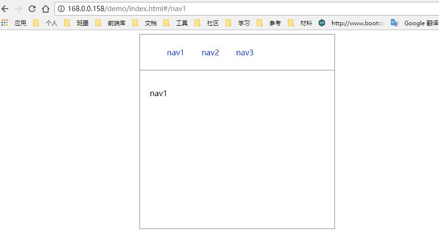
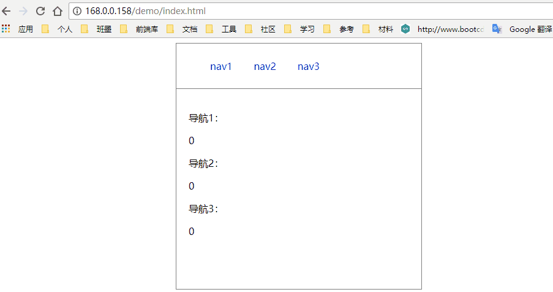
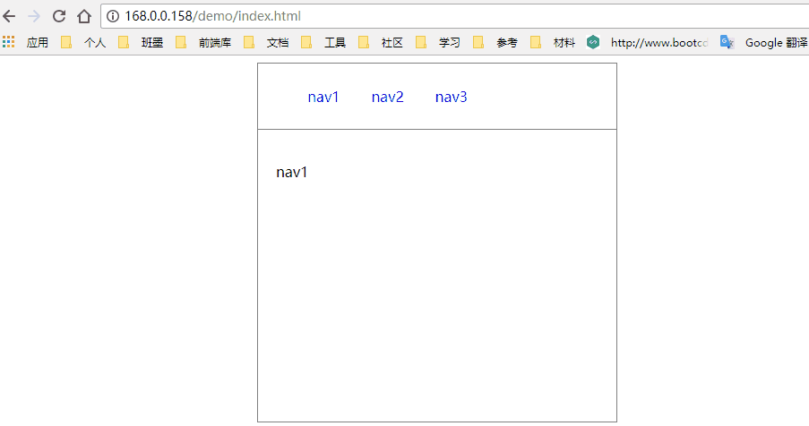
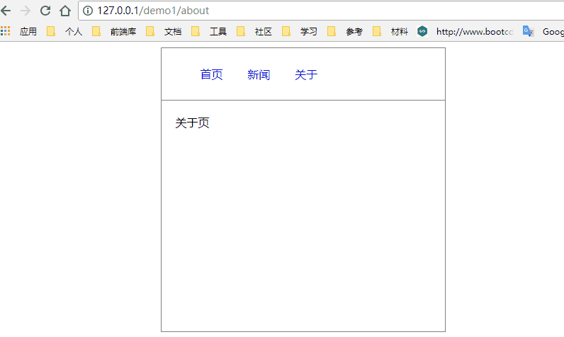
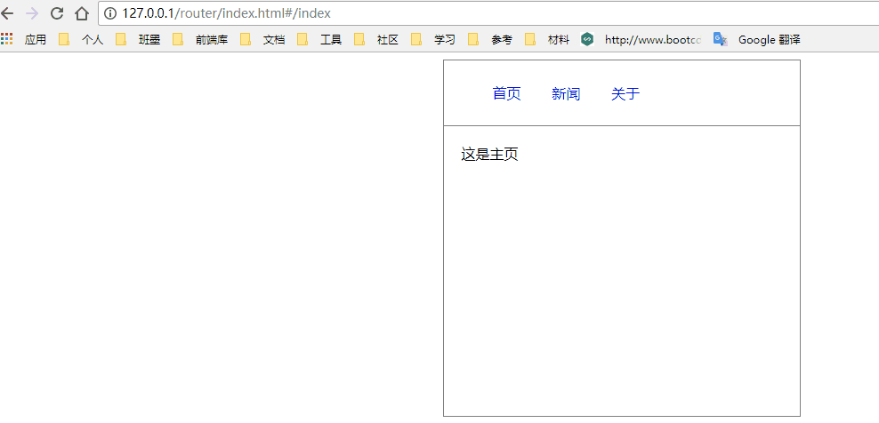

> MDN:The History interface allows manipulation of the browser session history, that is the pages visited in the tab or frame that the current page is loaded in.

<!-- more -->

#### 了解

`HTML5 history`新增了两个`API`:`history.pushState`和`history.replaceState`

两个`API`都接收三个参数：

  - 状态对象（`state object`）：一个JavaScript对象，与用`pushState()`方法创建的新历史记录条目关联。无论何时用户导航到新创建的状态，`popstate`事件都会被触发，并且事件对象的state属性都包含历史记录条目的状态对象的拷贝。

  - 标题（`title`）：FireFox浏览器目前会忽略该参数，虽然以后可能会用上。考虑到未来可能会对该方法进行修改，传一个空字符串会比较安全。或者，你也可以传入一个简短的标题，标明将要进入的状态。

  - 地址（`URL`）： 新的历史记录条目的地址。浏览器不会在调用`pushState()`方法后加载该地址，但之后，可能会试图加载，例如用户重启浏览器。新的URL不一定是绝对路径；如果是相对路径，它将以当前URL为基准；传入的URL与当前URL应该是同源的，否则，`pushState()`会抛出异常。该参数是可选的；不指定的话则为文档当前URL。

**相同之处**是两个` API `都会操作浏览器的历史记录，而不会引起页面的刷新。

**不同之处**在于`pushState`会增加一条新的历史记录，而`replaceState`则会替换当前的历史记录。

这里大家可以先`F12`试试，看看地址栏发生了什么变化

```
window.history.pushState(null, null, "hell");

window.history.pushState(null, null, "/hell");

window.history.pushState(null, null, "#/hello");

window.history.pushState(null, null, "?name=");

```

> 注意：这里的url不支持跨域，否则会抛出异常

#### 尝试

`index.html`

```
<!DOCTYPE html>
<html lang="en">
<head>
    <meta charset="UTF-8">
    <meta name="viewport" content="width=device-width, initial-scale=1.0">
    <meta http-equiv="X-UA-Compatible" content="ie=edge">
    <title>前端路由实现</title>
    <style>
        .warp{
            width:400px;
            height:400px;
            border:1px solid grey;
            margin:0 auto;
        }
        .nav{
            border-bottom:1px solid grey;
        }
        .nav li{
            display:inline-block;
            list-style:none;
        }
        .nav li a{
            display:inline-block;
            text-decoration: none;
            padding:10px 15px;
        }
        .router{
            padding:20px;
        }
        a{
            cursor: pointer;
        }
    </style>
    
</head>
<body>
    <section class="warp">
        <div class="nav">          
            <ul>
                <li><a href="javascript:void(0)" data-path="index">首页</a></li> 
                <li><a href="javascript:void(0)" data-path="news">新闻</a></li>
                <li><a href="javascript:void(0)" data-path="about">关于</a></li>
            </ul>
        </div>
        <div id="router" class="router">
            <!-- 内容加载区域 -->
        </div>
    </section>
    
    <script src="https://cdn.bootcss.com/jquery/3.3.1/jquery.min.js"></script>
    <script src="./router.js"></script>
 
</body>
</html>

```


##### 一：简单开胃菜

`router.js`


```
;(function(){  	
  	history.replaceState(null,null,'');//最开始的状态，采用replace直接替换
    $('#router').html('<p>nav1</p>')
	$('a').on('click',function(){
		console.log(this.text)
		var text = this.text;
		$('#router').html('<p>'+ text +'</p>')
		history.pushState(null,null,'#/'+text);
	})    
})()

```


最简单的示例，只能监听点击事件,而浏览器中的后、前进都不能监听地址栏的改变

##### 二、数据状态管理

`router.js`

```

状态版
;(function(){  	
  	var count = [0,0,0]
  	$('#router').html('<p>导航1：</p>'+count[0]+'<p>导航2：</p>'+count[1]+'<p>导航3：</p>'+count[2])
  	history.replaceState(count,null,'');//最开始的状态，采用replace直接替换
    
    for(var i = 0 ; i<$('a').length; i++){
    	$('a')[i].index = i
    	$('a').eq(i).on('click',function(){
    		console.log(this.index);
    		var index = this.index;
    		count[index]++;
    		$('#router').html('<p>导航1：</p>'+count[0]+'<p>导航2：</p>'+count[1]+'<p>导航3：</p>'+count[2])
    		history.pushState(count,null,'#/count'+count[index]);//之后的状态，需要进行保存
    	})
    }
    	
    
    //监听history其他api导致地址栏url改变事件
    window.addEventListener('popstate',function(e){
	    console.log(e.state);
	    var state = e.state;
	    $('#router').html('<p>导航1：</p>'+state[0]+'<p>导航2：</p>'+state[1]+'<p>导航3：</p>'+state[2])
	    
    })
})()


```



`popstate`
>当活动历史记录条目更改时，将触发popstate事件。如果被激活的历史记录条目是通过对history.pushState（）的调用创建的，或者受到对history.replaceState（）的调用的影响，popstate事件的state属性包含历史条目的状态对象的副本。

>需要注意的是调用history.pushState()或history.replaceState()不会触发popstate事件。只有在做出浏览器动作时，才会触发该事件，如用户点击浏览器的回退按钮（或者在Javascript代码中调用history.back()）

##### 三：回归简单

`router.js`

```
;(function(){  	
  	
  	var url = 'nav1';

  	history.replaceState(url,null,'');//最开始的状态，采用replace直接替换
    $('#router').html('<p>'+url+'</p>')

	$('a').on('click',function(){
		console.log(this.text)
		url = this.text;

		$('#router').html('<p>'+ url +'</p>')
		history.pushState(url,null,'#/'+url);
	})
	window.addEventListener('popstate',function(e){
	    console.log(e.state);
	    url = e.state
		$('#router').html('<p>'+ url +'</p>')
	    
	 });     
})()

```


兜兜转转我们算是回到了起点，但是通过这张图我们会发现页面点击刷新按钮会有导航和内容块不一致的内容，所以我们需要改进他，并且监听`load`事件

改进

```

;(function(){  	
  	
	$('a').on('click',function(){
		console.log(this.text)
		url = this.text;

		$('#router').html('<p>'+ url +'</p>')
		history.pushState(url,null,'#/'+url);
	})
	window.addEventListener('popstate',function(e){
	    console.log(e.state);
	    url = e.state
		$('#router').html('<p>'+ url +'</p>')
	    
	 });
	window.addEventListener('load',function(){
		url = location.hash.slice(2) || 'nav1';
		history.replaceState(url,null,'');
		console.log(location.hash);
		$('#router').html('<p>'+ url +'</p>');
	});

      
})()

```


可以看到我们点击刷新的时候导航和内容区域一致了。

##### 四：路由页面引进

我们这里还是采用了`ajax`的`load`方法

`router.js`

```
;(function(){ 


	var router = [
  		{
	  		'path':'index',
	  		'url':'./main.html'
  		},
  		{
	  		'path':'news',
	  		'url':'./news.html'
  		},
  		{
	  		'path':'about',
	  		'url':'./about.html'
  		}
  	];

  	//改变页面
  	function display_page(url){
  		$('#router').load(url)
  	}

	$('a').on('click',function(){
		var path = $(this).data('path');
		console.log(path)
		for(var i in router){
			if(router[i].path == path){
				display_page(router[i].url);
				history.pushState(router[i].url,null,router[i].path);
			}
		}
	})
	window.addEventListener('popstate',function(e){
		var url = e.state;
	    display_page(url);
	    
	});
	window.addEventListener('load',function(){
		var start = location.href.lastIndexOf('/');

		var path = location.hash.slice(start) || 'index';
		console.log(path)

		for(var i in router){//刷新 加载
			console.log(1)
			if(router[i].path == path){
				display_page(router[i].url);	
				history.replaceState(router[i].url,null,path);		
				break;	
			}
			if(i == router.length-1){//重定向
				display_page(router[0].url);	
				history.replaceState(router[i].url,null,router[0].path);	
			}
		}						
	});

})()

```


可以看到基本是实现了`history`路由功能，但是这里有一个问题就是刷新后因为地址栏url原因会报错，也就是找不到这个页面，这是由于刷新的时候是重载，重新向网站目录查找文件，而我们当前目录并没有这个文件资源所以导致报错。**需要后台拦截！** 放弃！ 

折中

最后我还是屈服于`#`了
```
;(function(){  	
  	
  	var router = [
  		{
	  		'path':'index',
	  		'url':'./main.html'
  		},
  		{
	  		'path':'news',
	  		'url':'./news.html'
  		},
  		{
	  		'path':'about',
	  		'url':'./about.html'
  		}
  	];

  	//改变页面
  	function display_page(url){
  		$('#router').load(url)
  	}

	$('a').on('click',function(){
		var path = $(this).data('path');
		console.log(path)
		for(var i in router){
			if(router[i].path == path){
				display_page(router[i].url);
				history.pushState(router[i].url,null,'#/'+router[i].path);
			}
		}
	})
	window.addEventListener('popstate',function(e){
		var url = e.state;
	    display_page(url);
	    
	});
	window.addEventListener('load',function(){
		var path = location.hash.slice(2) || '/index';
		console.log(path)
		for(var i in router){//刷新 加载
			console.log(1)
			if(router[i].path == path){
				display_page(router[i].url);	
				history.replaceState(router[i].url,null,'#/' + path);		
				break;	
			}
			if(i == router.length-1){//重定向
				display_page(router[0].url);	
				history.replaceState(router[0].url,null,'#/' + router[0].path);	
			}
		}						
	});

})();
```


勉强的很呀

代码：<a href="https://github.com/jx915/wheels/tree/master/router(history)" title = "router(history)"> router(history)</a>
演示： <a href="https://jx915.github.io/wheels/router(history)/" title = "演示地址"> 演示地址</a>